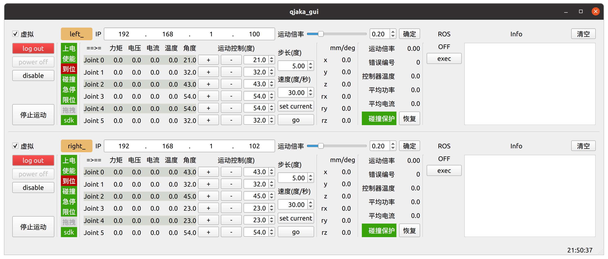

# QJAKA_GUI

节卡机械臂图形界面 + ROS



## 依赖

- ROS

- [bprinter](https://github.com/dattanchu/bprinter)：终端表格打印

  ```bash
  cd ~/Opt  # 可随意
  git clone https://github.com/dattanchu/bprinter.git
  cd bprinter
  mkdir build && cd build
  cmake .. && make -j4
  sudo make install
  ```

- jaka sdk：

  - 修改`CmakeLists.txt`中的`set(Jaka_DIR "/home/msi/Opt/jaka_sdk")`（35行附近），修改为你的路径

  - ```bash
    # sdk文件夹结构示例:
    /home/msi/Opt/jaka_sdk
    ├── include
    │   ├── JAKAZuRobot.h
    │   ├── jkerr.h
    │   └── jktypes.h
    ├── JakaConfig.cmake  # 本仓库doc下
    └── lib
        ├── libjakaAPI.so
        └── libz.a
    ```

- robot_model：本仓库doc下zip压缩包，包含urdf和moveit配置例子
  - `Zu7/urdf/jaka_macro.xacro`：添加了macro `prefix`，用以区分左右机械臂；
  - `Zu7/urdf/jaka_dual.xacro`：双臂；
  - `Zu7/urdf/jaka.urdf.xacro`：官方文件，单机械臂；
  - `dual_moveit_config`：使用moveit配置助手，基于`Zu7/urdf/jaka_dual.xacro`生成的。

## 程序设计

### 机器人类 `VirtualRobot` 和 `RealRobot`

使用多态特性，封装机械臂访问和控制的统一阻塞接口。

- `VirtualRobot`：虚拟机械臂，接口为虚函数，阻塞接口；

- `RealRobot`：继承自`VirtualRobot`，代理节卡sdk接口；

### 机器人管理类 `RobotManager`

将机器人类的阻塞接口转为非阻塞接口，供GUI线程调用，同时emit QT信号来刷新界面。

其中包含了四个线程来执行机器人类中的阻塞函数，继承自`StackThread`类的线程接口只允许串行执行任务，例如一次`joint_move`任务被委托到`m_execThread`线程，在没有执行完毕前，`m_execThread`不再接受其他任务。即线程内串行，线程间并行：

- `m_preThread`：执行登录、上电、使能；
- `getThread`：成功登录后，以固定频率获取机器人全部状态(`get_robot_status`)
- `m_execThread`；执行关节移动等改变机器人状态的命令；
- `m_emergencyThread`：执行紧急函数，包括终止运动，碰撞恢复；

### 关于`ROS`

- 在login成功后，随着`getThread`的执行，机械臂关节信息也一并以固定频率发布，topic名为`jaka_joint_states`；

- 名为`jaka_trajectory_srv`的service接受带`moveit_msgs::RobotTrajectory`的请求，内部依次调用机器人的`joint_move`接口。

